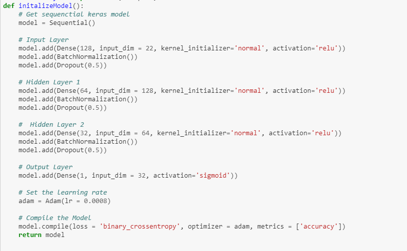
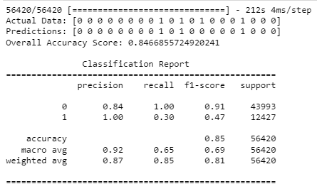

# Predicting Rain in Australia with Machine Learning

## Presentation
<ul>
	<li><a href="https://drive.google.com/file/d/1wKOLgBfgVbBIzNjm5v0Bb40ZcPuOenvl/view?usp=sharing" target="_blank">Final Presentation</a></li>
	<li><a href="https://docs.google.com/presentation/d/19yF-Agj6ZCcrFiVaeJ421IUeNZbz5jEHNCNFmDedbP8/edit?usp=sharing" target="_blank">Final Presentation Slide Deck</a></li>
</ul>

## Navigation
+ <a href="https://github.com/behnke2424/ai-mjbehnke/blob/master/final/Predicting%20Rain%20in%20Australia%20.ipynb" target="_blank">Source Code on Jupyter Notebook</a>
+ <a href="https://github.com/behnke2424/ai-mjbehnke/blob/master/final/weatherAUS.csv" target="_blank">Weather Data</a>

## Models and Results

Model without Hyperparameters

 

Model without Hyperparameters -- Classification Report

